# Microsoft Entra ID Administration Lab
### Bald Tech — Identity & Access Management Project

---

## Overview

This lab simulates a real-world Microsoft Entra ID (formerly Azure Active Directory) environment for a fictional company, **Bald Tech**. The goal is to demonstrate hands-on identity and access management (IAM) skills applicable to IT Support, Sysadmin, and Cloud Engineering roles.

All configurations were performed in a live Azure tenant using the Microsoft Entra admin center at [entra.microsoft.com](https://entra.microsoft.com). Every step is documented with screenshots taken directly from the portal.

---

## Environment

| Detail | Value |
|---|---|
| Tenant Name | Bald Tech |
| Tenant Domain | BaldTech792.onmicrosoft.com |
| Admin Account | MICHAELKING@BaldTech792.onmicrosoft.com |
| Admin Roles | Global Administrator, User Administrator |
| Entra ID License | P2 (Free Trial activated for lab) |
| Region | United States |
| Lab Date | June 2026 |

---

## Objectives

- Create and manage user accounts in Microsoft Entra ID
- Organize users into security groups by department
- Assign administrative roles using least-privilege principles
- Configure a Conditional Access policy to enforce MFA across all users
- Enable per-user MFA for all non-admin accounts
- Capture audit logs as proof of all administrative activity

---

## Lab Walkthrough

---

### Step 1 — Activate Entra ID P2

Before configuring Conditional Access and advanced security features, the Entra ID P2 free trial was activated from the Roles and administrators page.

**Why this matters:** Entra ID P2 unlocks Conditional Access policies, Identity Protection, and privileged identity management — features required for enterprise-grade security configurations.

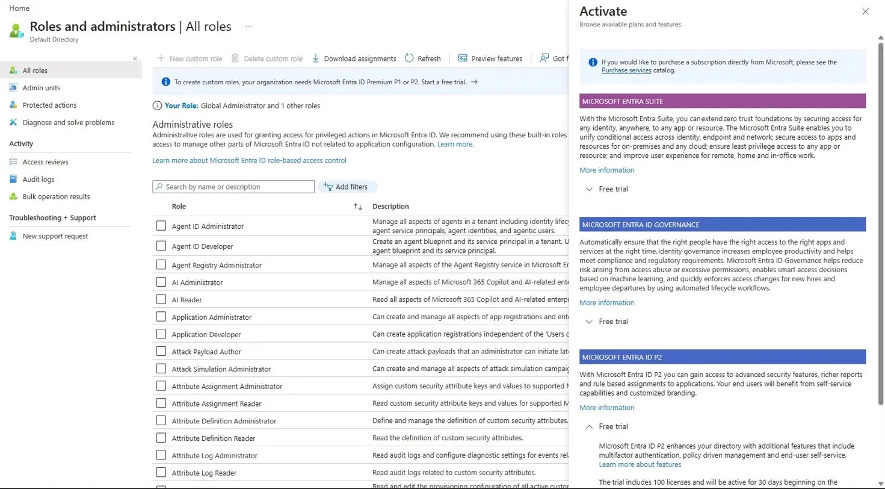
*Roles and administrators page with the Activate panel open showing Microsoft Entra ID P2 free trial option.*

---

### Step 2 — Create Users

Four standard user accounts were created to simulate employees at Bald Tech across different departments.

| Display Name | Username | Department |
|---|---|---|
| Bob Johnson | bjohnson@BaldTech792.onmicrosoft.com | HR |
| Josh Smith | jsmith@BaldTech792.onmicrosoft.com | IT |
| Lisa Chen | lchen@BaldTech792.onmicrosoft.com | Finance |
| Mark Davis | mdavis@BaldTech792.onmicrosoft.com | Management |

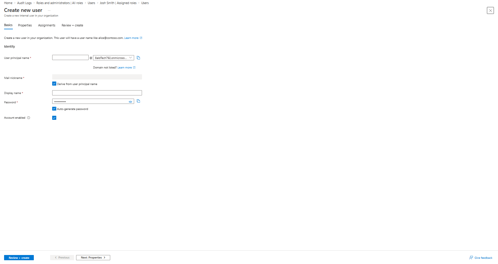
*The Create new user form showing the user principal name, display name, and auto-generated password fields.*

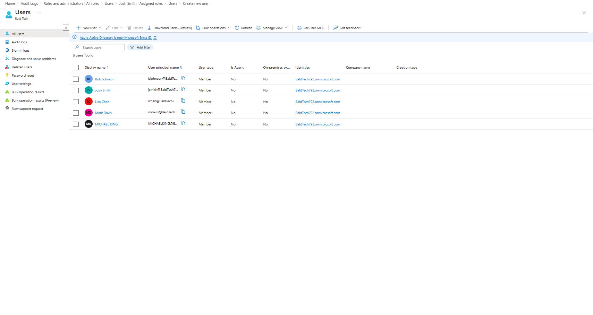
*The All Users list confirming all 5 accounts — Bob Johnson, Josh Smith, Lisa Chen, Mark Davis, and Michael King — are active members of the BaldTech792 tenant.*

---

### Step 3 — Create Security Groups

Three security groups were created to organize users by department. Security groups in Entra ID are used to manage access to resources and assign permissions at scale.

| Group Name | Type | Membership | Purpose |
|---|---|---|---|
| IT-Admins | Security | Assigned | IT department administrators |
| HR-Team | Security | Assigned | Human Resources staff |
| Finance-Team | Security | Assigned | Finance department staff |

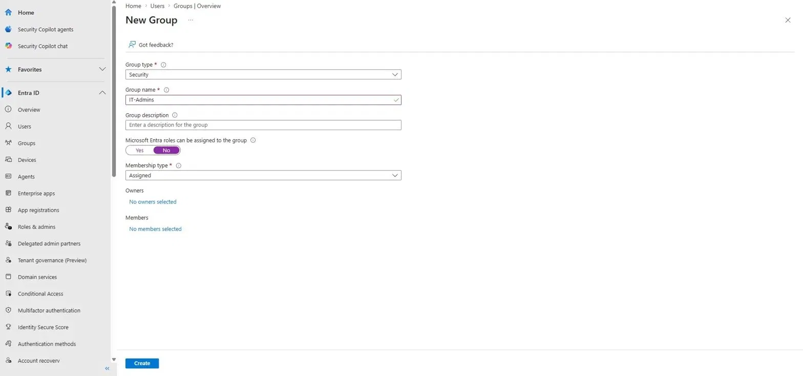
*The New Group creation form showing Group type set to Security, Group name set to IT-Admins, and Membership type set to Assigned.*

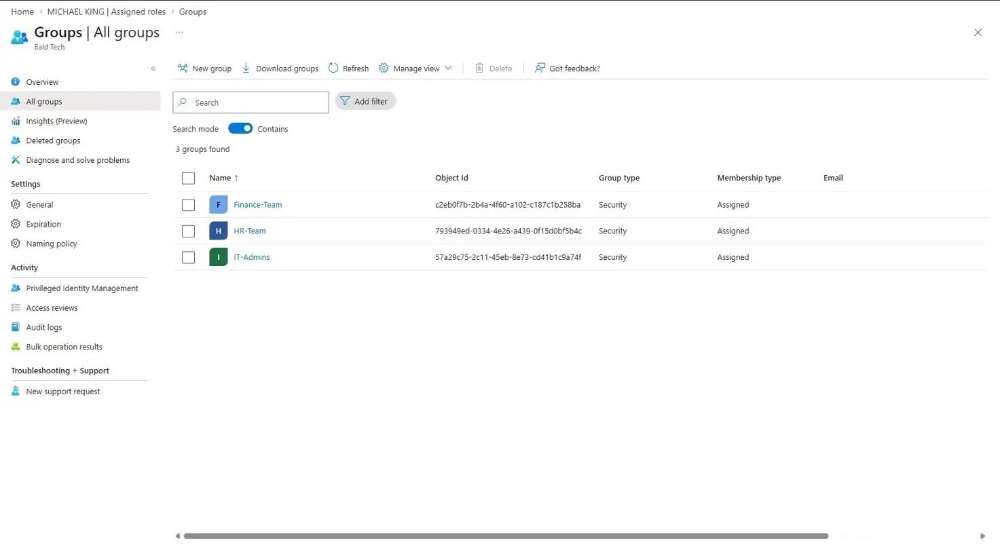
*The All Groups list confirming all three security groups — Finance-Team, HR-Team, and IT-Admins — were successfully created.*

---

### Step 4 — Assign Administrative Roles

Roles were assigned following the **principle of least privilege** — each user receives only the permissions required for their function.

| User | Role Assigned | Reason |
|---|---|---|
| Michael King | Global Administrator | Full tenant administration |
| Michael King | User Administrator | User and group management |
| Josh Smith | Helpdesk Administrator | Password resets and basic support tasks |

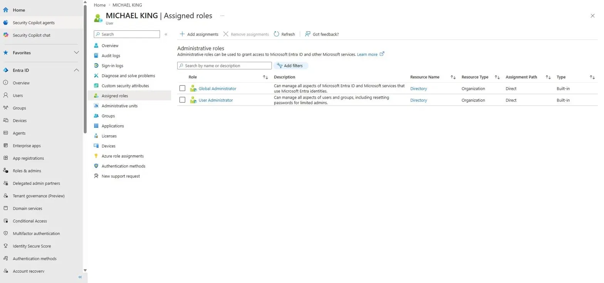
*Michael King's Assigned Roles page confirming Global Administrator and User Administrator roles, both assigned directly at the Organization scope.*

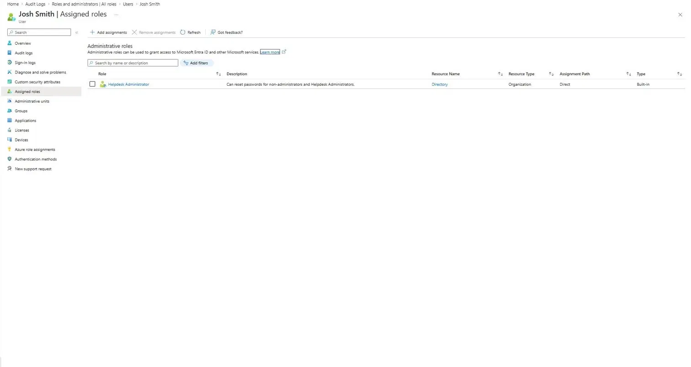
*Josh Smith's Assigned Roles page confirming the Helpdesk Administrator role was successfully assigned — Built-in role, Direct assignment, Organization scope.*

---

### Step 5 — Configure Conditional Access Policy

A Conditional Access policy was created to require MFA for all users accessing any cloud application. This is a core Zero Trust security control used in enterprise environments.

**Policy Configuration:**

| Setting | Value |
|---|---|
| Policy Name | Require MFA for All Users |
| Users Included | All users |
| Target Resources | All resources (formerly All cloud apps) |
| Access Control | Require multifactor authentication |
| Policy State | Report-only |

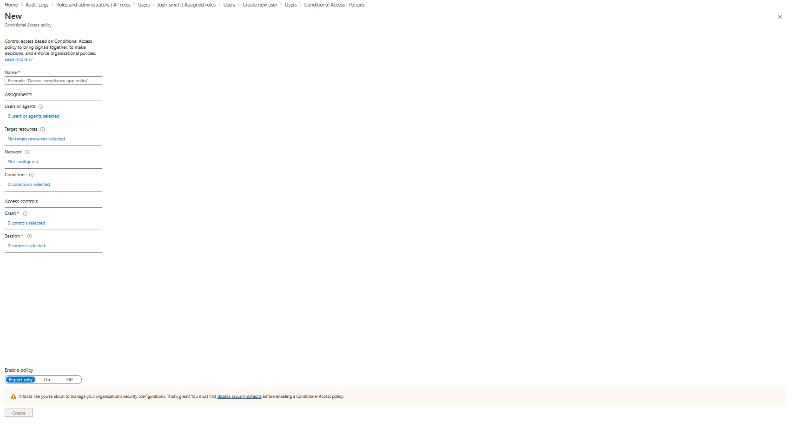
*The New Conditional Access policy form showing all configuration sections before values are applied.*

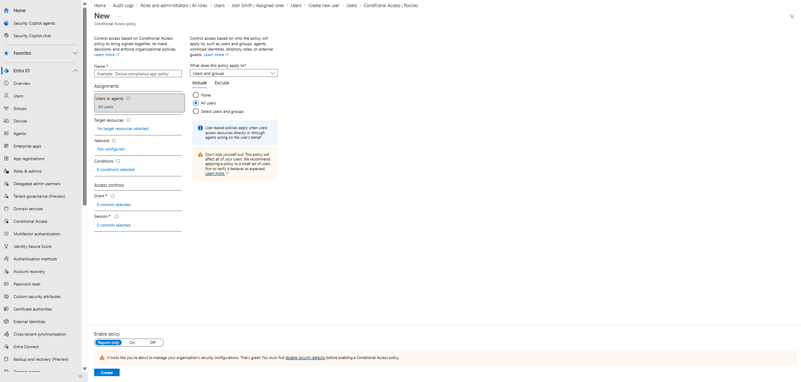
*The policy fully configured — named "Require MFA for All Users", Users set to All users, Enable policy set to Report-only.*

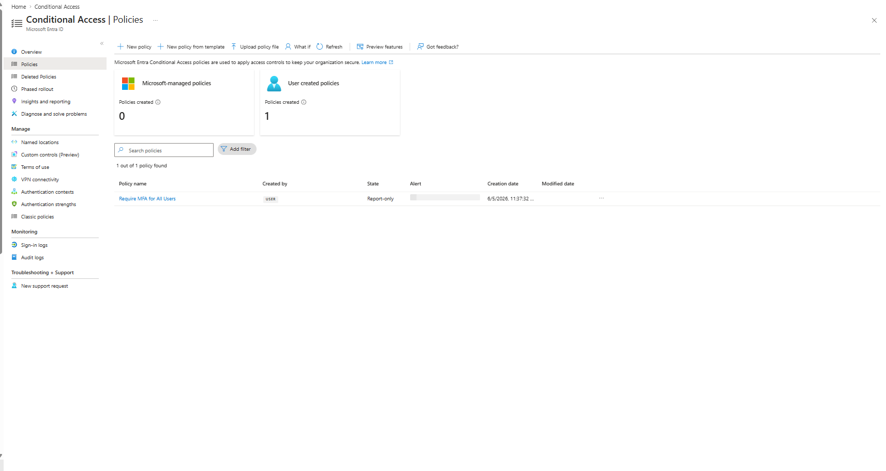
*The Conditional Access Policies overview confirming 1 user-created policy — "Require MFA for All Users" — state Report-only, created 6/5/2026.*

> **Why Report-only?**
> Report-only is Microsoft's recommended approach when first deploying a Conditional Access policy. It logs what *would* have been enforced without impacting user sign-ins, allowing administrators to validate policy scope before enabling full enforcement. This is real-world best practice.

---

### Step 6 — Enable Per-User MFA

Per-user MFA was enabled for all standard employee accounts via the Microsoft Entra MFA portal. The admin account (Michael King) was intentionally excluded — MFA for the admin is enforced separately through the Conditional Access policy.

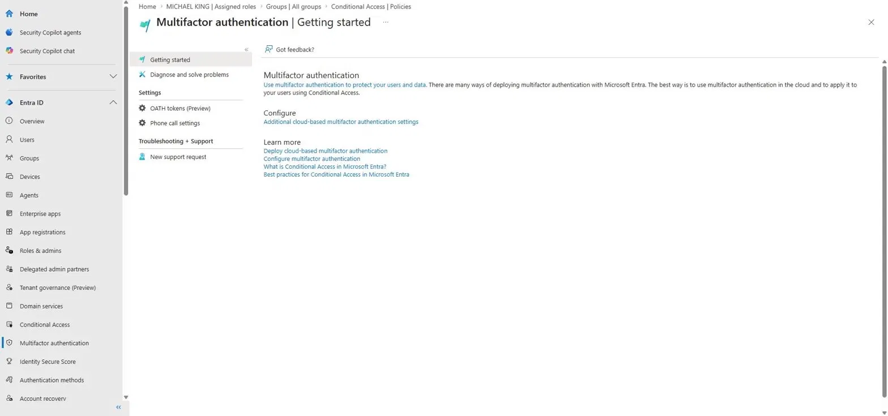
*The Multifactor Authentication Getting Started page showing the Configure section.*

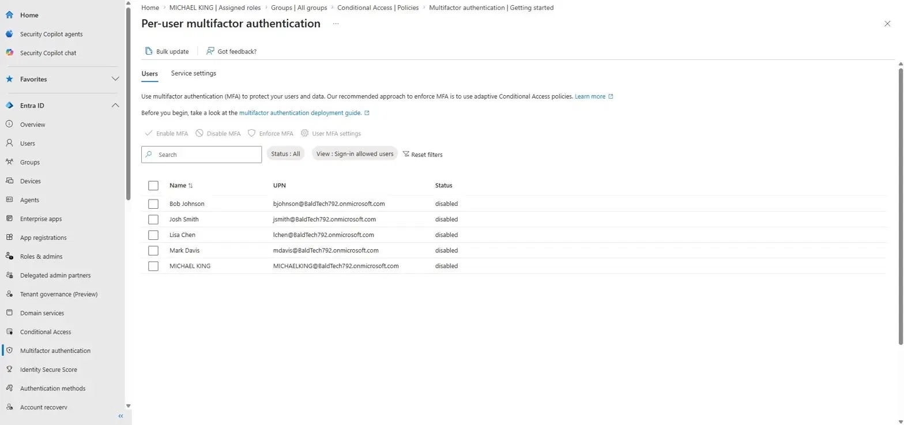
*Per-user MFA portal showing all 5 users with MFA status disabled — state before configuration.*

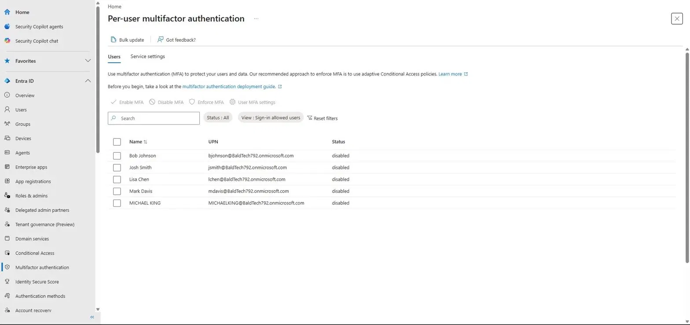
*Per-user MFA portal showing Josh Smith's status changed to enabled as MFA is applied to each user.*

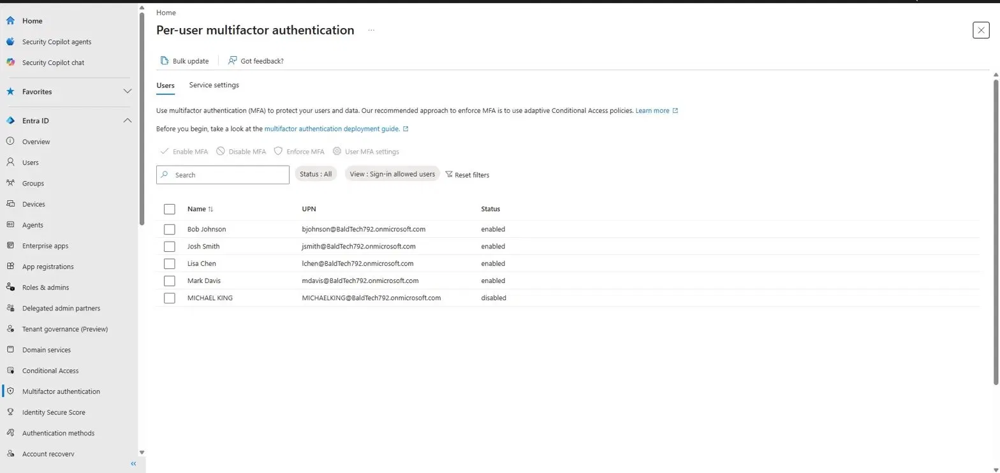
*Final state — Bob Johnson, Josh Smith, Lisa Chen, and Mark Davis all showing enabled. Michael King remains disabled (intentional — enforced via Conditional Access policy).*

---

### Step 7 — Audit Logs

All administrative actions performed during this lab were captured in the Entra ID Audit Logs. The audit log provides an immutable, timestamped record of every change made to the tenant — essential for compliance, security investigations, and accountability in enterprise environments.

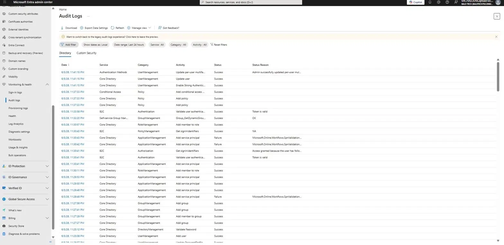
*The Entra ID Audit Logs page showing the full activity history from the lab session on 6/5/2026 — Add user, Add group, Add member to role, Add conditional access policy, Update per-user MFA — all Success.*

**Key audit events confirmed:**

| Time | Activity | Category | Status |
|---|---|---|---|
| 11:41 PM | Update per-user MFA | UserManagement | Success |
| 11:37 PM | Add conditional access policy | Policy | Success |
| 11:30 PM | Add member to role | RoleManagement | Success |
| 11:30 PM | Add member to role | RoleManagement | Success |
| 11:27 PM | Add group | GroupManagement | Success |
| 11:27 PM | Add group | GroupManagement | Success |
| 11:27 PM | Add member to group | GroupManagement | Success |
| 11:25 PM | Add user | UserManagement | Success |

---

## Skills Demonstrated

- **Identity & Access Management (IAM)** — full user lifecycle management, security group organization, role-based access control
- **Zero Trust Security** — MFA enforcement via Conditional Access policy targeting all cloud apps
- **Least Privilege Principle** — scoped role assignments; admin account excluded from per-user MFA and covered by Conditional Access instead
- **Enterprise Security Policy** — Conditional Access policy designed and deployed in Report-only mode following Microsoft best practices
- **Compliance & Auditing** — audit log review and documentation proving all administrative actions
- **Microsoft Entra ID / Azure AD** — hands-on live tenant administration using the Entra admin center

---

## Tools Used

- Microsoft Entra Admin Center ([entra.microsoft.com](https://entra.microsoft.com))
- Microsoft Entra ID P2 (Free Trial)
- Azure Portal ([portal.azure.com](https://portal.azure.com))

---

## Related Projects

- [Azure Cloud Monitoring & Alerting](../azure-monitoring)
- [Azure Security Infrastructure](../azure-security)
- [Azure Cost Visibility Dashboard](../azure-cost-dashboard)
- [osTicket on Azure](../osticket-azure)

---
